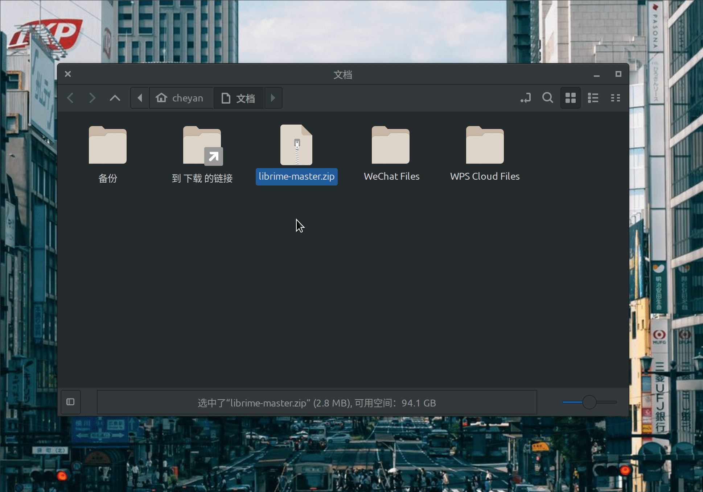

# WinRAR for Linux

一个简单的 WinRAR 程序，通过 wine 启动，并且可以关联 Linux 的压缩包。

Here is a simple WinRAR program that launches through Wine and can associate with Linux compressed files.

### Usage 使用

First, install Wine. Then clone this project to any directory and double-click the WinrarForLinux program to execute it.

先安装 wine，然后 clone 本项目到任一目录，双击 WinrarForLinux 程序即可执行。

### File Association 关联文件

Right-click on a file and specify the path of WinrarForLinux. This allows you to directly open compressed files with WinrarForLinux.

在文件上右键，指定 WinrarForLinux 的路径，即可使用 WinrarForLinux 直接打开压缩包。

### Association Principle 关联原理

WinRAR supports path invocation. For example, `winrar.exe "Z:\home\cheyan\file.zip"` can directly open file.zip.

`WinrarForLinux` is a simple script that converts Linux paths into paths recognizable by Wine. For example, `~/home/cheyan/file.zip` will be transformed into `Z:\home\cheyan\file.zip`, and then WinRAR.exe is invoked to open it.

WinRAR 支持路径调用，例如`winrar.exe "Z:\home\cheyan\file.zip"` 便可直接打开file.zip

`WinrarForLinux`是一个简单的脚本，把 Linux 下的路径转换成了了 wine 能识别的路径，例如 `~/home/cheyan/file.zip` 会转换成 `Z:\home\cheyan\file.zip`，然后再调用 WinRAR.exe 打开即可。